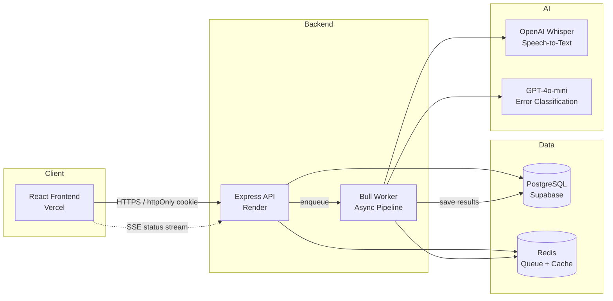

# Decodex — AI-Powered Diagnostic Reading Platform for Dyslexia Education


Decodex captures student reading aloud, transcribes via Whisper, aligns against source text with Needleman-Wunsch DP, classifies errors using Orton-Gillingham taxonomy (GPT-4o-mini), generates personalized practice drills, and gives teachers and parents actionable analytics with human-in-the-loop override capability.

---

## Live Demo

| Component | URL |
|-----------|-----|
| **Frontend** | [decodex-app.vercel.app](https://decodex-app.vercel.app) |
| **Backend Health** | [decodex-backend.onrender.com/health](https://decodex-backend.onrender.com/health) |

This is a fully deployed full-stack application. The frontend is served by Vercel, the backend runs on Render, and the database is hosted on Supabase.

**Test accounts:** `student@decodex.com` / `teacher@decodex.com` / `parent@decodex.com` — password `password123`

---

## Architecture



**Audio processing flow:** Student records → audio uploaded to Express → job enqueued in Redis/Bull → worker transcribes (Whisper) → aligns transcript to source (Needleman-Wunsch) → classifies errors (GPT-4o-mini with O-G taxonomy prompt) → saves results → generates drills → pushes status via SSE to frontend.

---

## Tech Stack

| Technology | Purpose |
|------------|---------|
| **React 19 + Vite** | Fast SPA with HMR; Vite's dev proxy simplifies local API calls |
| **TypeScript** | End-to-end type safety across frontend and backend |
| **Tailwind CSS 4** | Utility-first styling with a custom Decodex design system |
| **Express 5** | Lightweight HTTP framework with native async/await route handlers |
| **PostgreSQL** | Relational store for users, sessions, classifications, drills, and consent records |
| **Redis + Bull** | Job queue for async audio processing — decouples expensive transcription and classification from the request/response cycle |
| **OpenAI Whisper** | Speech-to-text transcription of student reading recordings |
| **GPT-4o-mini** | Error classification using strict Orton-Gillingham taxonomy prompts with JSON mode |
| **Opossum** | Circuit breaker around all OpenAI calls — degrades gracefully to a rule-based fallback when the AI provider is unavailable |
| **Recharts** | Data visualization for teacher dashboards (WPM trends, error category breakdowns) |
| **Zod** | Runtime schema validation for API request bodies |
| **bcrypt** | Password hashing with cost factor 12 |

---

## Key Technical Decisions

### Circuit Breaker Pattern (Opossum)

All OpenAI API calls (Whisper and GPT-4o-mini) are wrapped in Opossum circuit breakers. When the provider is down or rate-limited, the circuit opens and the system falls back to a deterministic Orton-Gillingham rule engine. This prevents cascading failures and ensures students always receive results — even if classification quality is temporarily reduced. Errors classified during fallback are tagged as `UNC` (Uncertain) so teachers can review them.

### Consent-Gating Architecture

Because Decodex processes children's reading data, parental consent is required before any audio recording can occur. The system uses:
- **Invite codes** for in-app parent-student linking
- **Knowledge-based verification** (date of birth) with rate-limited attempts
- **Consent withdrawal** with a 30-day hard-delete grace period
- **Data erasure jobs** that purge session data when consent is withdrawn

The `requireConsent` middleware blocks the audio upload endpoint until a valid `parent_student_links` record with `consent_granted = TRUE` exists.

### Role-Based + Relationship-Verified Authorization

Beyond simple role checks (`student`, `teacher`, `parent`, `admin`), data access is scoped by verified relationships:
- **Students** can only access their own sessions, drills, and results (IDOR guards on every endpoint)
- **Teachers** can access student data only for students at the same school (`school_id` join)
- **Parents** can access data only for children linked via `parent_student_links`
- **Admins** bypass relationship checks entirely

---

## Local Development Setup

### Prerequisites

- Node.js 20+
- Docker (for PostgreSQL and Redis) or local PostgreSQL 14+ and Redis 6+

### 1. Start infrastructure

```bash
docker compose up -d   # Starts PostgreSQL (port 5432) and Redis (port 6379)
```

### 2. Backend

```bash
cd backend
cp .env.example .env
# Edit .env — set JWT_SECRET (min 32 chars), DATABASE_URL, OPENAI_API_KEY or GROQ_API_KEY
npm install
npm run dev            # Starts on http://localhost:3000
```

### 3. Frontend

```bash
cd frontend
npm install
npm run dev            # Starts on http://localhost:5173, proxies /api to backend
```

### 4. Run tests

```bash
cd backend && npm test
cd frontend && npm test
```

### Environment Variables

| Variable | Required | Description |
|----------|----------|-------------|
| `JWT_SECRET` | **Yes** | Random string ≥32 chars. Generate with `openssl rand -base64 32` |
| `DATABASE_URL` | **Yes** | PostgreSQL connection string |
| `REDIS_URL` | **Yes** | Redis connection string |
| `OPENAI_API_KEY` | Yes* | OpenAI API key for Whisper + GPT-4o-mini |
| `GROQ_API_KEY` | Yes* | Alternative free-tier API key (Groq) |
| `FRONTEND_URL` | No | Frontend origin for CORS (defaults to `http://localhost:5173`) |
| `GMAIL_USER` | No | Gmail address for consent email delivery |
| `GMAIL_APP_PASSWORD` | No | Google App Password for email |

*At least one of `OPENAI_API_KEY` or `GROQ_API_KEY` is required.

---

## Security

- **Parameterized SQL queries** — all database access uses parameterized queries; no string interpolation of user input
- **bcrypt password hashing** — cost factor 12, no plaintext passwords stored
- **httpOnly cookie authentication** — JWT stored in httpOnly, secure, sameSite cookie; no localStorage token storage
- **Rate limiting** — strict limits on auth endpoints (10 req/15 min), moderate global limit on all API routes (60 req/15 min)
- **Relationship-verified data access** — students, teachers, and parents can only access data they have a verified relationship to
- **Consent gating** — audio recording is blocked until verifiable parental consent is on file
- **Error message masking** — internal error details are not exposed to clients in production
- **CORS allowlist** — only the deployed frontend origin and preview deployments are permitted

---

## Project Structure

```
├── backend/
│   ├── src/
│   │   ├── routes/        # Express route handlers
│   │   ├── middleware/     # Auth, RBAC, consent, upload
│   │   ├── services/      # Business logic (alignment, classification, drills)
│   │   ├── queue/          # Bull worker for async audio pipeline
│   │   ├── db/             # Schema, migrations, seed data
│   │   └── __tests__/      # Backend test suite
│   └── vitest.config.ts
├── frontend/
│   ├── src/
│   │   ├── pages/          # Route page components
│   │   ├── components/     # Shared UI components
│   │   ├── hooks/          # Custom hooks (SSE, API queries)
│   │   ├── lib/            # API client, utilities
│   │   ├── context/        # AuthContext provider
│   │   └── __tests__/      # Frontend test suite
│   └── vite.config.ts
├── documents/              # PRD, TRD, specs, feature tickets
├── .github/workflows/      # CI pipeline
└── docker-compose.yml      # Local dev infrastructure
```

---

## License

ISC
